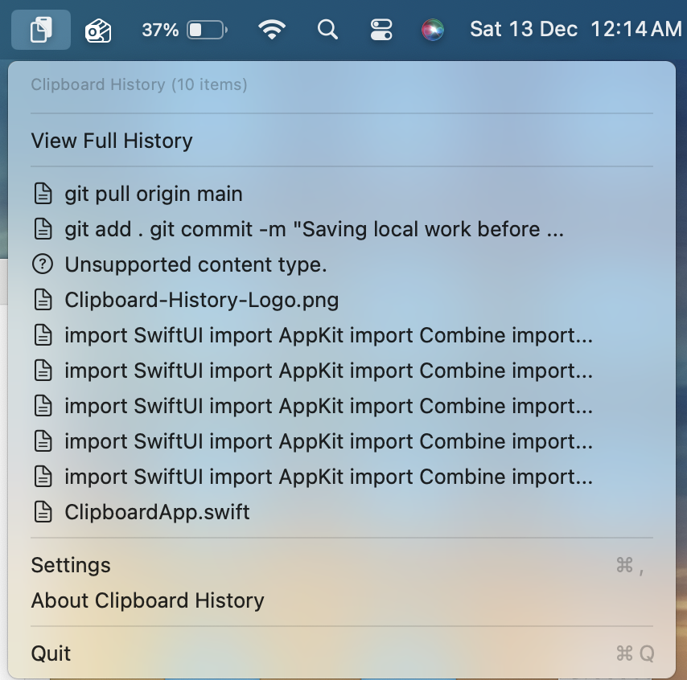
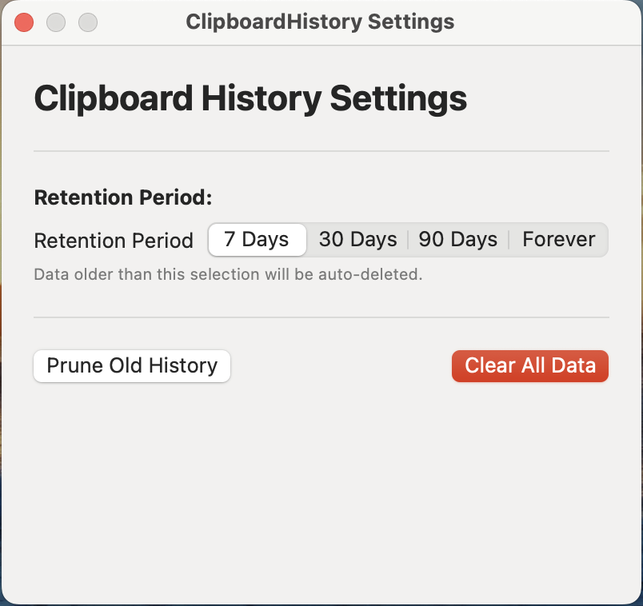
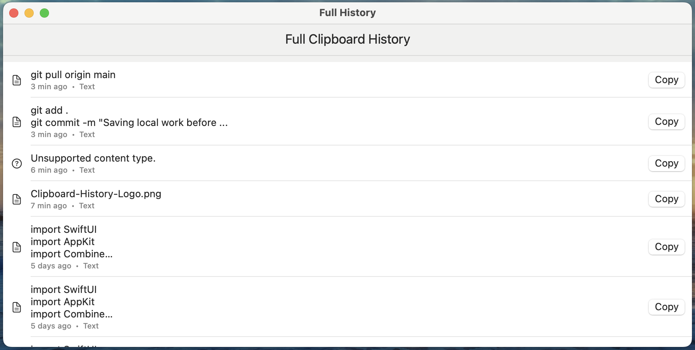

# Clipboard History App for macOS

A native macOS menu bar utility that tracks your clipboard history — built with Swift

  

---

## Features

- **Clipboard Monitoring** — Automatically tracks copied text and file paths.
- **Menu Bar Access** — Quickly view your **last 10 copied items** right from the menu bar.  
  

    
  

- **Persistent History** — Stores up to **30 days** of clipboard history *(configurable)* using **SwiftData**.
- **Smart Actions**:
  - **Click Text** — Copies text back to the clipboard.
  - **Click File** — Opens the file directly.
  - **Option + Click File** — Copies the file path instead of opening.
- **Custom Settings** — Choose your retention period: **7, 30, 90 days, or Forever**.  
  

    
  

- **Full History View** — Browse and manage your complete clipboard archive.  
  

    
  

---

## Installation

### Option 1: Build from Source

Clone this repository
git clone https://github.com/Sudeep05/ClipboardHistoryApp.git

Navigate into the project directory
cd ClipboardHistoryApp

Open in Xcode
open ClipboardHistory.xcodeproj

- Requires **macOS 15+** and **Xcode 16+**.  
- In Xcode, click **Run ▶ (Cmd + R)** to build and launch the app.

---

## How It Works

The app continuously monitors macOS’s **NSPasteboard** for new clipboard events. It intelligently filters supported content types:
- ✅ Plain text
- ✅ File paths

Clipboard entries are saved locally using **SwiftData’s SQLite persistence**, enabling:
- Fast access even when offline  
- Configurable retention for privacy-conscious users  
- Efficient data cleanup to conserve memory

---

##  Why was this app made?

I always was in need of accessing my clipboard history during work to find something which i used way back in a week or so, wanted to make this app to solve that purpose for me. In the process , i tried to access files, text as part of my cliboard history. Hope it helps you efficiently.

---

## Author

**Pala Sudeep Kumar**  
Beginner to Coding 

---

## License

This project is released under the **MIT License**.  
See the [LICENSE](LICENSE) file for complete details.  
